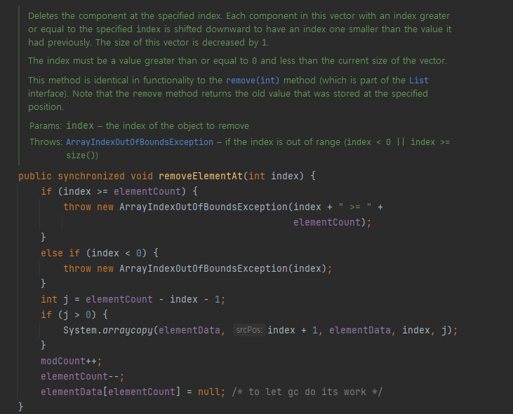

## Item 07

**다 쓴 객체 참조 해제의 중요성**

### 개요
자바는 가비지 컬렉션(GC)을 통해 자동으로 메모리를 관리하지만, 프로그래머가 주의하지 않으면 **메모리 누수**가 발생할 수 있다.

### GC 언어에서의 메모리 누수
- GC 언어에서는 메모리 누수를 찾기가 까다롭다.
- 다 쓴 객체의 **참조가 하나라도 남아있으면 GC의 대상이 되지 않는다.**

예시: Stack 클래스
```java
public class Stack {
    private Object[] elements;
    private int size = 0;
    private static final int DEFAULT_INITIAL_CAPACITY = 16;

    public Stack() {
        elements = new Object[DEFAULT_INITIAL_CAPACITY];
    }

    public void push(Object e) {
        ensureCapacity();
        elements[size++] = e;
    }

    public Object pop() {
        if (size == 0)
            throw new EmptyStackException();
        Object result = elements[--size];
        return result;
    }

    private void ensureCapacity() {
        /* 생략 */
    }
}
```

### 문제점
- pop() 메서드에서 다 쓴 객체의 참조가 해제되지 않는다.
- elements 배열에 pop된 객체의 참조가 여전히 남아있어 GC가 회수할 수 없다.
- 이로 인해 불필요한 메모리 사용량이 증가한다.

### 해결책: **null 처리**
```java
public Object pop() {
    if (size == 0)
        throw new EmptyStackException();
    Object result = elements[--size];
    elements[size] = null; // 다 쓴 참조 해제
    return result;
}
```

### null 처리의 이점
1. GC의 대상이 되도록 명시적으로 표시
2. 실수로 다 쓴 객체를 참조할 경우 `NPE(NullPointerException)`를 발생시켜 프로그램 오류를 조기에 발견 가능

### 주의사항
- 객체 참조를 null로 처리하는 것은 예외적인 경우에만 수행해야 함
- **과도한 null 처리는 코드를 복잡**하게 만들 수 있음

### Java 컬렉션의 객체 참조 해제
- **대부분의 Java 컬렉션 클래스들은 이미 내부적으로 객체 참조 해제를 처리**하고 있음
- 따라서 개발자가 직접 null 처리를 할 필요가 없는 경우가 많음

### best practice
1. 변수의 범위를 최소화하여 자연스럽게 참조가 해제되도록 설계
2. 컬렉션 사용 시 가능한 표준 Java 컬렉션 클래스 활용
3. 직접 자료구조를 구현할 때만 명시적인 null 처리 고려

- 다음과 같이 대부분의 컬렉션 클래스들은 이미 객체 참조 처리하게 되어있다.



### 객체 참조 관리의 best practice

1. 객체 참조 해제 방법

a) 컬렉션 사용 시
```java
List<String> strList = new ArrayList<>();
strList.add("Java");
strList.add("Python");

strList.clear(); // 리스트를 비워 참조를 해제
```

b) 개별 객체 참조 해제
```java
List<Object> objectList = new ArrayList<>();
Object obj = new Object();
objectList.add(obj);
objectList.remove(obj);

obj = null; // 객체 참조를 해제
```

2. 변수 스코프 관리

변수를 **적절한 스코프 내에서 관리**하는 것이 가장 효과적인 방법이다.

```java
public class ScopeExample {
    public static void main(String[] args) {
        createAndUseObject();
        // 이 시점에서 obj는 더 이상 접근할 수 없다.

        // 다른 작업을 수행
        otherThing();
    }

    private static void createAndUseObject() {
        Object obj = new Object();
        System.out.println(obj);
    } // obj의 스코프가 여기서 종료됨

    private static void otherThing() {
        // 다른 작업 수행
        System.out.println("other..");
    }
}
```

### 스코프(Scope)와 참조
**스코프의 정의**:
`스코프`는 변수나 객체가 유효한 범위를 의미한다. 즉, 특정 변수나 객체에 접근할 수 있는 코드의 영역을 나타낸다.
`obj`는 `createAndUseObject()` 메서드 내에서 선언되었기 때문에, 이 메서드의 스코프 안에서만 접근이 가능하다.

**스코프 종료**:
`createAndUseObject()` 메서드가 종료되면, 그 안에서 선언된 obj 변수도 더 이상 유효하지 않게 된다. 이 시점에서 obj는 메모리에서 참조가 끊어진다. 즉, obj에 대한 접근이 불가능해지며, 해당 **객체에 대한 참조가 없어지는 것**이다.

3. 리소스 해제의 중요성과 방법

### 리소스 해제의 필요성
- GC는 메모리 관리는 하지만 파일, 데이터베이스 연결 등의 시스템 리소스는 자동으로 관리하지 않음
- 명시적인 리소스 해제가 필요함

### try-with-resources 구문 사용

```java
try (FileReader fr = new FileReader("example.txt");
     BufferedReader br = new BufferedReader(fr)) {
    String line;
    while ((line = br.readLine()) != null) {
        System.out.println(line);
    }
} catch (IOException e) {
    e.printStackTrace();
}
// try-with-resources 구문이 자동으로 리소스를 닫아줌
```

1. **리소스 선언**:
FileReader와 BufferedReader 객체를 try 구문에서 선언한다. 이 객체들은 AutoCloseable 인터페이스를 구현하고 있기 때문에 자동으로 닫힐 수 있다.

2. **리소스 사용**:
BufferedReader를 사용하여 파일에서 한 줄씩 읽어들여 출력한다.

3. **자동 리소스 해제**:
try 블록이 끝나면 FileReader와 BufferedReader 객체는 자동으로 close() 메서드가 호출되어 리소스가 해제된다. 따라서, 개발자가 명시적으로 close()를 호출하지 않아도 된다.

4. **예외 처리**:
IOException에 대한 예외 처리를 통해 파일 입출력 중 발생할 수 있는 오류를 처리한다.

### try-with-resources의 장점
1. 자동 리소스 해제: finally 블록 없이도 리소스가 자동으로 닫힘
2. 코드 간결성: 명시적인 close() 호출 불필요
3. 예외 처리 개선: 리소스 닫기 중 발생한 예외도 적절히 처리

### 주의사항
1. AutoCloseable 인터페이스: try-with-resources에서 사용할 리소스는 AutoCloseable 인터페이스를 구현해야 함
2. 여러 리소스 관리: 여러 리소스를 동시에 관리할 수 있으며, 선언된 순서의 역순으로 닫힘
3. 커스텀 리소스: 직접 만든 리소스 클래스에도 AutoCloseable을 구현하여 사용 가능

### other 리소스 해제 방법
1. finally 블록 사용 (try-with-resources 이전 방식)
2. 명시적 close() 메서드 호출

4. 캐시 관리와 메모리 누수 방지

1. 일반적인 캐시 사용의 문제점
```java
public class MemoryLeakExample {
    private Map<String, Object> cache = new HashMap<>();

    public void addToCache(String key, Object value) {
        if (!cache.containsKey(key)) {
            cache.put(key, value);
        }
    }
    // 이 메서드는 객체를 계속 캐시에 추가만 하고, 제거하지 않음
}
```

2. WeakHashMap을 사용한 개선
```java
public class WeakHashMapExample {
    public static void main(String[] args) {
        Map<Object, String> weakHashMap = new WeakHashMap<>();
        Object key = new Object();

        weakHashMap.put(key, "Example Value");

        // 키에 대한 참조가 존재하는 동안은 데이터가 유지됨
        System.out.println("Before removing reference: " + weakHashMap.containsKey(key));

        key = null; // 키에 대한 참조를 제거, 이제 GC의 대상이 된다
    }
}
```

WeakHashMap의 특징
- 키에 대한 다른 강한 참조가 없으면 GC의 대상이 될 수 있음
- 메모리 관리에 유리하지만, 예기치 않게 데이터가 사라질 수 있어 주의 필요

3. 캐시 엔트리 관리 전략
- 엔트리의 유효 기간 설정이 어려운 경우, **시간에 따라 엔트리의 가치를 감소**시키는 방식 사용
- 백그라운드 스레드를 사용하여 주기적으로 캐시 정리
- 새 엔트리 추가 시 부수적으로 오래된 엔트리 제거

개선된 캐시 관리 예시
```java
public class ImprovedCache<K, V> {
    private final Map<K, CacheEntry<V>> cache = new ConcurrentHashMap<>();
    private final long expirationTimeMillis;

    public ImprovedCache(long expirationTimeMillis) {
        this.expirationTimeMillis = expirationTimeMillis;
    }

    public void put(K key, V value) {
        long expirationTime = System.currentTimeMillis() + expirationTimeMillis;
        cache.put(key, new CacheEntry<>(value, expirationTime));
    }

    public V get(K key) {
        CacheEntry<V> entry = cache.get(key);
        if (entry != null && !entry.isExpired()) {
            return entry.getValue();
        } else {
            cache.remove(key);
            return null;
        }
    }

    private static class CacheEntry<V> {
        private final V value;
        private final long expirationTime;

        CacheEntry(V value, long expirationTime) {
            this.value = value;
            this.expirationTime = expirationTime;
        }

        boolean isExpired() {
            return System.currentTimeMillis() > expirationTime;
        }

        V getValue() {
            return value;
        }
    }
}
```

5. 콜백 함수와 리스너 관리

### 콜백과 리스너의 메모리 누수 위험
- 객체가 다른 객체에 리스너로 등록되면, 등록된 객체는 리스너에 대한 참조를 유지함
- 사용하지 않는 **리스너를 해제하지 않으면 메모리 누수 발생** 가능

### 리스너 관리 예시
```java
public class SimpleEventExample {
    public static void main(String[] args) {
        EventManager manager = new EventManager();

        EventListener listener = new EventListener() {
            @Override
            public void onEvent() {
                System.out.println("Event occurred!");
            }
        };

        manager.addListener(listener);
        manager.fireEvent(); // 이벤트 발생

        manager.removeListener(listener); // 리스너 해제
    }
}
```

### 리스너 관리
   a. **명시적 해제**: 사용이 끝난 리스너는 반드시 removeListener() 등의 메서드로 해제
   b. **WeakReference 사용**: 리스너를 WeakReference로 저장하여 GC가 수거할 수 있게 함
   c. **생명주기 관리**: 리스너의 생명주기를 명확히 정의하고 관리


메모리 누수는 겉으로 잘 드러나지 않아 시스템에 수년간 잠복하는 사례도 있다.
따라서, 위와 같은 예방법을 익혀두는 것이 중요하다.


