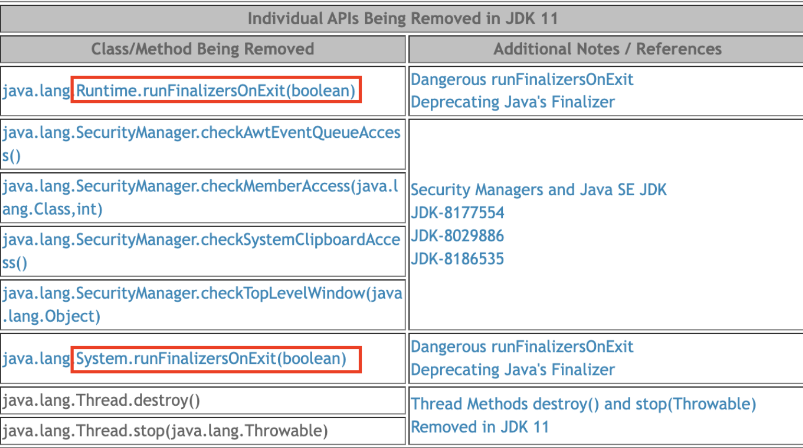

## Item 08

### finalizer와 cleaner 사용을 피하라

finalizer 개요
- `finalizer`는 finalize 메소드를 오버라이드하여 **Garbage Collection 대상**이 될 때 수행됨
- Java 9부터 deprecated되었으며, Cleaner가 대안으로 제시됨
- finalize() 메서드와 Cleaner는 모두 자바 가상 머신(JVM)에서 자동으로 관리되는 메커니즘이다.

`finalizer`와 `cleaner`의 문제점

1. 즉시 수행 보장 없음
   - 언제 실행될지 예측 불가능
   - 실행 시간도 불확실
   - 원하는 시점에 실행 불가능
   - 파일 리소스를 반납하는 작업을 처리한다면 그 파일 리소스가 언제 처리 될지 알 수 없음

   예시:
   ```java
   class ResourceManager {
       private Resource resource;

       @Override
       protected void finalize() {
           resource.close(); // 언제 실행될지 모름
       }
   }
   ```

2. 실행 속도 불확실
   - **가비지 컬렉터** 알고리즘에 전적으로 의존
   - JVM마다 다른 동작 가능성

3. 우선순위 낮음
   - Finalizer 쓰레드의 **우선순위가 낮아** 실행 기회를 놓칠 수 있음
   - 작업이 처리되지 못하고 대기하다 `OutOfMemoryError` 발생 가능

   잠재적 문제 상황:
   ```java
   class LowPriorityTask {
       @Override
       protected void finalize() {
           // 우선순위가 낮아 실행되지 않을 수 있는 작업
           heavyOperation();
       }
   }
   ```

4. 실행 보장의 부재
- finalizer와 cleaner는 실행이 보장되지 않는다.
- 전혀 실행되지 않을 가능성도 존재한다.
- 실행 시점을 예측할 수 없다.

5. 위험한 사용 사례
- **영구적인 상태 변경**이나 중요한 자원 해제에 부적합하다.
- 예: 데이터베이스 연결의 락 해제
  ```java
  @Override
  protected void finalize() throws Throwable {
  // 락걸린거 이 객체가 소멸될 때 같이 락을 해제하면 되겠다! -> X
  }
  ```
- 이런 방식은 시스템 전체를 점진적으로 마비시킬 수 있다.

### 예시
객체가 소멸될 때, 그 **객체가 소유하고 있는 락을 해제하는 것이 매우 중**요하다.
만약 객체가 소멸되었음에도 불구하고 락이 해제되지 않으면, 해당 락이 걸린 자원은 **다른 스레드가 접근하지 못하게 되어** 시스템의 성능 저하나 `교착 상태(Deadlock)` 같은 심각한 문제를 일으킬 수 있다.

6. 잘못된 접근 방법
- `System.gc`나 `System.runFinalization` 메서드로 실행을 보장하려는 시도
- 이 메서드들은 실행 가능성만 높일 뿐, 절대적인 보장을 하지 않는다.
- 관련 메서드들은 결함으로 인해 **deprecated**되거나 최신 Java 버전에서 제거되었다.



7. 예외 처리의 문제
- finalizer 동작 중 발생한 예외는 무시된다.
- 남은 작업도 중단되어 객체가 불완전한 상태로 남을 수 있다.
- `finalizer`의 예외는 경고조차 출력하지 않아 더욱 위험하다.
- `cleaner`는 자체 스레드 사용으로 이 문제를 일부 완화할 수 있다.

8. 성능 저하
- `AutoCloseable` 객체와 try-with-resources 사용 대비:
   - **finalizer 사용 시 객체 생성과 소멸에 훨씬 더 많은 시간 소요**
   - 가비지 컬렉터의 효율을 크게 저하시킨다.
- 안전망 형태로 제한적 사용 시 성능 저하를 일부 완화 가능

9. 공격에 노출될 수 있는 취약점
- `finalizer`와 `cleaner`는 객체 생성이나 직렬화 과정에서 예외가 발생할 때 보안 취약점을 드러낼 수 있다.
- 생성되다 만 객체에서 악의적인 하위 클래스의 finalizer가 실행될 수 있다.

### 취약점 예시 코드:

1. 기본 클래스 (KakaoBank):
```java
public class KakaoBank {
    private int money;

    public KakaoBank(final int money) {
        if (money < 1000) {
            throw new RuntimeException("1000원 이하로 생성이 불가능해요.");
        }
        this.money = money;
    }

    void transfer(final int money) {
        this.money -= money;
        System.out.println(MessageFormat.format("{0}원 입금 완료!!", money));
    }
}
```

2. 악의적인 하위 클래스 (BankAttack):
```java
public class BankAttack extends KakaoBank {
    public BankAttack(final int money) {
        super(money);
    }

    @Override
    protected void finalize() throws Throwable {
        this.transfer(1000000000);
    }
}
```

3. 공격 실행 코드:
```java
public class Main {
    public static void main(final String[] args) throws InterruptedException {
        KakaoBank bank = null;
        try {
            bank = new BankAttack(500);
            bank.transfer(1000);
        } catch (Exception e) {
            System.out.println("예외 터짐");
        }
        System.gc();
        sleep(3000);
    }
}
```

### 취약점 분석:
- BankAttack 객체 생성 시 **부모 클래스의 생성자에서 예외가 발생**한다.
- 정상적으로는 객체 생성이 실패해야 하지만, finalizer가 구현되어 있어 가비지 컬렉션 시점에 실행된다.
- `finalizer`에서 **악의적인 코드(거액 이체)가 실행**되어 보안 문제가 발생한다.

### 보안 대책:
- finalizer 사용을 피하고, 대신 **try-with-resources와 같은 안전한 자원 관리 방식**을 사용한다.
- 필요한 경우 finalizer guardian 패턴을 사용하여 하위 클래스의 finalizer 공격을 방지할 수 있다.

이러한 취약점은 finalizer와 cleaner 사용을 피해야 하는 또 다른 중요한 이유가 된다.

📌 대안: `AutoCloseable` 인터페이스 구현

- `AutoCloseable`을 구현하고 클라이언트에서 인스턴스 사용 후 close 메서드를 호출한다.
- try-finally 또는 try-with-resources를 사용하여 자원을 안전하게 종료한다.

### 예시 코드:
```java
public class Sample implements AutoCloseable {
    @Override
    public void close() {
        System.out.println("close");
    }
}
```

`finalizer`와 `cleaner`의 적절한 사용 사례

1. 안전망 역할로 자원 반납
    - 클라이언트가 close 메서드를 호출하지 않았을 때를 대비한다.
    - **즉시 호출은 보장되지 않지만, 늦게라도 자원을 회수하는 것이 낫다.**
    - 예: FileInputStream, FileOutputStream, ThreadPoolExecutor

2. 네이티브 자원 정리
    - 네이티브 피어(네이티브 메서드를 통해 기능을 위임받은 네이티브 객체)와 연결된 객체에 사용한다.
    - 자바 가비지 컬렉터가 네이티브 객체까지 회수하지 못하는 경우에 활용한다.

### 주의사항
- 안전망 역할로 finalizer를 작성할 때는 그 가치를 신중히 고려해야 한다.
- 성능 저하를 감당할 수 없거나 자원을 즉시 회수해야 하는 경우에는 여전히 close 메서드를 사용해야 한다.

10. Cleaner 사용 예시

```java
public class Room implements AutoCloseable {
    private static final Cleaner cleaner = Cleaner.create();

    private static class State implements Runnable { 
        int numJunkPiles;

        State(int numJunkPiles) {
            this.numJunkPiles = numJunkPiles;
        }

        @Override
        public void run() {
            System.out.println("Room Clean");
            numJunkPiles = 0;
        }
    }

    private final State state;
    private final Cleaner.Cleanable cleanable;

    public Room(int numJunkPiles) {
        state = new State(numJunkPiles);
        cleanable = cleaner.register(this, state);
    }

    @Override
    public void close() {
        cleanable.clean();
    }
}
```

### Cleaner 사용 시 주의사항

1. 순환 참조 방지
    - State 클래스는 Room을 참조하면 안 된다.
    - State를 static 내부 클래스로 선언하여 바깥 객체(Room)를 참조하지 않도록 한다.

2. 안전망 역할
    - Cleaner는 주로 안전망 역할을 한다.
    - 클라이언트가 close 메서드를 호출하지 않았을 때를 대비한다.

3. 실행 보장 없음
    - Cleaner의 실행(run 메서드 호출)은 보장되지 않는다.
    - 가비지 컬렉터의 동작 시점에 의존하기 때문에 즉시 실행되지 않을 수 있다.

### 사용 예시

1. 정상적인 자원 해제 (권장 방식)
```java
public static void main(final String[] args) {
    try (Room myRoom = new Room(8)) {
        System.out.println("방 쓰레기 생성~~");
    }
}
```
- try-with-resources를 사용하여 자원을 안전하게 해제한다.
- 이 경우 "Room Clean" 메시지가 항상 출력된다.

2. 불확실한 자원 해제 (권장하지 않음)
```java
public static void main(final String[] args) {
    new Room(8);
    System.out.println("방 쓰레기 생성~~");
}
```
- Cleaner에 의존하여 자원을 해제하려는 경우
- "Room Clean" 메시지가 출력되지 않을 수 있다.
