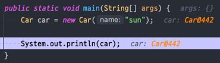
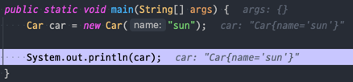

# Item12

### toString 메서드의 재정의 필요성

1. **기본 구현의 한계**:
    - 기본 toString 메서드는 `클래스명@해시코드`의 형태로 반환한다.
    - 이는 객체의 **실제 정보(사용자가 원하는 정보)를 제공하지 않아 유용성이 떨어진다.**

2. **정보 제공의 중요성**:
    - 객체의 주요 정보를 포함한 문자열 반환이 더 유익하다.
    - 예: `name: sun`과 같은 형태가 객체 이해에 도움이 된다.

3. **사용성 향상**:
    - 잘 구현된 `toString` 메서드는 클래스 사용을 더 즐겁게 만든다.
    - 시스템 디버깅 과정을 크게 개선한다.

4. **광범위한 활용**:
    - `println`, `문자열 연결`, `assert 구문` 등에서 자동으로 사용된다.
    - 디버거의 객체 출력 시에도 중요한 역할을 한다.

5. **가독성 개선**:
    - 특히 컬렉션 객체에서 중요하다.
    - 예: Map에서 `{Jenny = 012-1234-5678}`가 `{Jenny = PhoneNumber@addbb}`보다 훨씬 이해하기 쉽다.

결론적으로, `toString` 메서드의 적절한 재정의는 **객체의 명확성을 높이고**, **코드의 가독성과 디버깅 용이성을 크게 향상**시키는 중요한 작업이다.

___

### toString을 재정의하지 않은 예시의 결과



### toString을 재정의한 예시의 결과



### 그래서 어떻게 재정의 하는데?
**toString 메서드의 효과적인 재정의 방법**

1. **정보의 명확성**
  - 간결하면서도 사람이 읽기 쉬운 형태여야 한다. 객체의 유익한 정보를 담아야 한다.

**변환 예시**
```
PhoneNumber@adbbd -> 012-1234-5678   
Car@442           -> Car{name=sun, position=2}
```

2. **정보의 포괄성**
객체가 가진 주요 정보를 **모두 포함**하는 것이 좋다.

3. **부분 정보 반환의 문제점**
일부 정보만 반환하는 것은 바람직하지 않다. 다음 예시는 좋지 않은 방법이다:

```java
class Address {
    private final String city;
    private final String gu;
    private final String dong;
    private final String detail;

    Address(String city, String gu, String dong, String detail) {
        this.city = city;
        this.gu = gu;
        this.dong = dong;
        this.detail = detail;
    }

    @Override
    public String toString() {
        return "Address{" +
                "city='" + city + '\'' +
                ", gu='" + gu + '\'' +
                '}';
    }
}
```

이 예시에서는 `city`와 `gu`만 반환하고 있어 **불완전한 정보를 제공**한다.

4. **대용량 객체의 처리**
객체가 매우 크거나 문자열로 표현하기 어려운 경우, 요약 정보를 제공한다. 예: "맨해튼 거주자 전화번호부(총 1487536개)"

5. **구현 시 고려사항**
객체의 중요한 필드를 모두 포함해야 한다. 필드 이름과 값을 함께 표시하는 것이 좋다. 일관된 형식을 사용하여 가독성을 높인다.

- **주의사항**
  - `순환 참조`를 조심해야 한다. 반환값에 **중요한 정보나 보안에 민감한 정보가 포함되지 않도록 주의**한다.

### toString 구현 시 포맷 문서화에 대한 고려사항

1. **포맷 문서화의 중요성**
값 클래스(예: 전화번호부, 행렬)의 경우 `toString` **반환값의 포맷을 문서화**하는 것이 좋다. 이는 객체를 표준적이고, 명확하며, 사람이 읽기 쉽게 만든다.

포맷 적용 예시
```java
public String toString() {
    return String.format("%s-%s-%s", areaCode, prefix, lineNumber);
}
```

포맷 적용 효과
```
// 포맷 적용 전
PhoneNumber{areaCode='02', prefix='512', lineNumber='1234'}

// 포맷 적용 후
02-512-1234
```

2. **포맷 명시의 장단점**
**장점**:
- 읽기 쉽고 명확한 표현
- 표준화된 형식 제공

**단점**:
- 한번 명시된 포맷은 변경이 어려움
- 널리 사용되는 클래스의 경우 포맷 변경이 어려워짐

3. **포맷 미명시의 이점**:
- 향후 릴리스에서 정보 추가나 포맷 개선의 유연성 확보

4. **API 제공의 중요성**
포맷 명시 여부와 관계없이 toString이 반환한 값에 포함된 정보를 얻을 수 있는 **API를 제공**해야 한다. 이는 다음과 같은 이유로 중요하다:
- 접근자 미제공 시 프로그래머가 toString 반환값을 파싱해야 함
- 파싱은 성능 저하와 불필요한 작업을 초래
- 향후 포맷 변경 시 시스템 오류 가능성

예를 들어 접근자 미제공은 다음과 같다.
1. 접근자 미제공 (문자열 파싱 필요)

```java
public class Person {
    private String name;
    private int age;

    public Person(String name, int age) {
        this.name = name;
        this.age = age;
    }

    @Override
    public String toString() {
        return "Person{name='" + name + "', age=" + age + "}";
    }
}

// 사용 예
public class Main {
    public static void main(String[] args) {
        Person person = new Person("Alice", 30);
        String personString = person.toString();

        // 문자열 파싱
        String[] parts = personString.replace("Person{", "").replace("}", "").split(", ");
        String name = parts[0].split("=")[1].replace("'", "");
        int age = Integer.parseInt(parts[1].split("=")[1]);

        System.out.println("Name: " + name + ", Age: " + age);
    }
}

```
`toString()`의 반환값을 파싱해야 하므로 코드가 복잡해지고 성능이 저하될 수 있다.
또한, `toString()`의 형식이 바뀔 경우 오류가 발생할 수 있다.

2. 접근자 제공 (명확한 API)
```java
public class Person {
    private String name;
    private int age;

    public Person(String name, int age) {
        this.name = name;
        this.age = age;
    }

    public String getName() {
        return name;
    }

    public int getAge() {
        return age;
    }

    @Override
    public String toString() {
        return "Person{name='" + name + "', age=" + age + "}";
    }
}

// 사용 예
public class Main {
    public static void main(String[] args) {
        Person person = new Person("Alice", 30);
        
        // 접근자를 사용하여 정보 얻기
        String name = person.getName();
        int age = person.getAge();

        System.out.println("Name: " + name + ", Age: " + age);
    }
}

```
접근자 메서드를 통해 객체의 속성에 직접 접근할 수 있으므로, **문자열을 파싱할 필요가 없다.** 코드가 간결해지고, 성능이 향상되며, toString()의 형식 변경 시에도 안전하다.

### toString 재정의가 불필요한 경우
- 정적 유틸리티 클래스
- 이미 toString이 제공되는 Enum 타입

