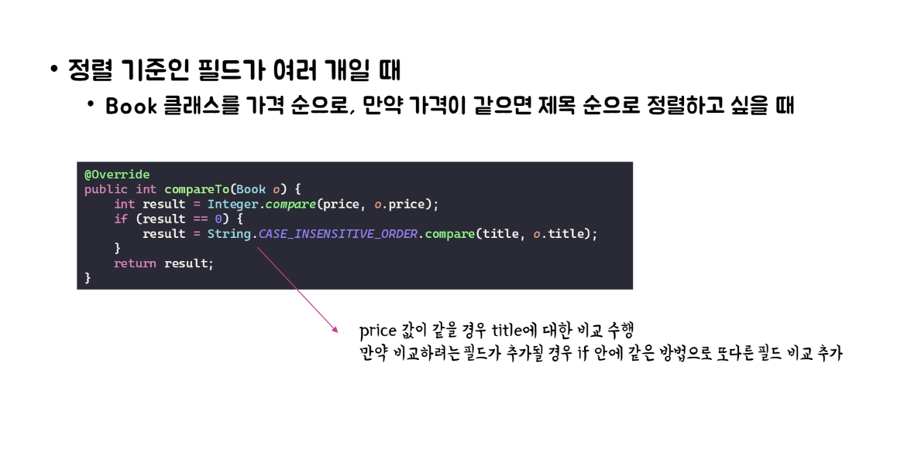

# Item14

## Comparable을 구현할지 고려하라.


1. **Primitive 타입과 객체의 비교**
    - 이미지의 첫 번째 예제는 `primitive` 타입인 int를 비교하고 있다.
    - Primitive 타입은 기본적으로 비교 연산자(>, <, ==)를 사용할 수 있다.


2. **객체의 정렬**
    - 두 번째 예제는 int 배열을 정렬하고 있다.
    - **Arrays.sort()** 메서드를 사용하여 정렬이 가능하다.


1. 
- 이 Book 객체들을 `ArrayList`에 추가한다.
- `Collections.sort()` 메서드를 사용하여 books 리스트를 정렬하려고 시도한다.

2.
- `Collections.sort(books)` 호출 시 에러가 발생한다.
- **에러 메시지**: **"error: no suitable method found for sort(List<Book>)"**

3. **원인**:
`Book 클래스`가 **Comparable 인터페이스를 구현하지 않았**거나,
`sort() 메서드`에 **Comparator를 제공하지 않았기 때문**이다.


## Comparable을 구현할 때는 규약을 지키자.


1. **부호 일관성**
   - `x.compareTo(y)`와 `y.compareTo(x)`의 부호는 **반대**여야 한다.
   - 즉, 만약 `x.compareTo(y)`가 **양수**라면, `y.compareTo(x)`는 **음수**여야 하고, 그 반대도 성립해야 한다.


2. **상호 일관성**
   - `x.compareTo(y)`가 `0`이면 `y.compareTo(x)`도 `0`이어야 한다.
   - 이는 두 객체가 **동등하다고 판단**될 때 양방향으로 일관성 있게 동작해야 함을 의미한다.


3. **등가성**
   - `x<y`면 `y>x`여야 하고, `x==y`면 `y==x`여야 한다.
   - 이는 `compareTo` 메서드의 결과가 수학적 비교 연산자와 일관되어야 함을 나타낸다.


4. **예외 일관성**
   - `x.compareTo(y)`가 예외를 던지면 `y.compareTo(x)`도 예외를 던져야 한다.
   - 즉, 비교 불가능한 상황에 대해 양방향으로 동일하게 처리해야 한다.


5. **추이성**
   - **조건**: `x.compareTo(y) > 0`이고 `y.compareTo(z) > 0`이면 `x.compareTo(z) > 0`이다.
   - **설명**: 즉, `x>y`이고 `y>z`이면 `x>z`여야 한다.
   - **의미**: 이는 비교의 `추이성`을 보장합니다. 세 개 이상의 객체를 비교할 때 일관성 있는 결과를 제공한다.
   - **중요성**: 이 규약은 정렬 알고리즘의 안정성과 예측 가능성을 보장한다.


6. **반사성과 동등성의 일치**
   - **조건**: `x.compareTo(y) == 0`이면 `x.compare(z)`와 `y.compare(z)`의 값이 같다.
   - **설명**: 즉, **x와 y가 같다면 모든 z에 대하여 x와 y의 비교 결과는 같아**야 한다.
   - **의미**: 이는 compareTo 메서드가 equals 메서드와 일관성을 가져야 함을 의미한다.
   - **중요성**: 이 규약은 정렬된 컬렉션(예: TreeSet, TreeMap)에서 객체의 동등성이 올바르게 처리되도록 보장한다.


7. **권고사항**
   - (x.compareTo(y) == 0) == (x.equals(y))여야 한다.
   - 즉, **compareTo로 수행한 동치성 테스트의 결과가 equals의 결과와 같아**야 한다.


7-1. **규약의 의미**
   - compareTo로 정의된 순서와 equals의 결과가 일관되어야 함을 의미한다.
   - 이 규약을 잘 지키면 compareTo로 줄지은 순서와 equals의 결과가 일관된다.


7-2. **주의사항**
   - 이 규약을 지키지 않는 클래스는 그 사실을 명시해야 한다.


7-3. **규약을 지키지 않은 예시: BigDecimal**
   - `new BigDecimal("1.0")`과 `new BigDecimal("1.00")`
   - `compareTo`로 비교하면 두 인스턴스가 같지만, `equals`로 비교하면 서로 다르다.
   - 결과: TreeSet에서는 원소를 1개만, HashSet에서는 원소를 2개 갖게 된다.

```java
import java.math.BigDecimal;
import java.util.HashSet;
import java.util.TreeSet;

public class BigDecimalExample {
    public static void main(String[] args) {
        BigDecimal bd1 = new BigDecimal("1.0");
        BigDecimal bd2 = new BigDecimal("1.00");

        // TreeSet 예시
        TreeSet<BigDecimal> treeSet = new TreeSet<>();
        treeSet.add(bd1);
        treeSet.add(bd2);
        System.out.println("TreeSet size: " + treeSet.size());  // 출력: 1

        // HashSet 예시
        HashSet<BigDecimal> hashSet = new HashSet<>();
        hashSet.add(bd1);
        hashSet.add(bd2);
        System.out.println("HashSet size: " + hashSet.size());  // 출력: 2
    }
}
```

1. **TreeSet의 경우**

TreeSet은 원소를 추가할 때 compareTo() 메서드를 사용하여 비교한다.
bd1.compareTo(bd2)는 0을 반환한다 (수학적으로 동일한 값이므로).
따라서 TreeSet은 bd1과 bd2를 동일한 원소로 간주하여 하나만 저장한다.


2. **HashSet의 경우**

HashSet은 원소를 추가할 때 equals() 메서드를 사용하여 비교한다.
bd1.equals(bd2)는 false를 반환한다 (스케일이 다르므로).
따라서 HashSet은 bd1과 bd2를 서로 다른 원소로 간주하여 둘 다 저장한다.

- BigDecimal의 `compareTo()`는 수학적 값만을 비교한다.
- BigDecimal의 `equals()`는 값과 함께 스케일(소수점 이하 자릿수)도 비교한다.

7-4. 중요성:
   - 정렬된 컬렉션(TreeSet, TreeMap 등)과 동등성 비교 기반 컬렉션(HashSet, HashMap 등) 간의 일관성을 유지한다.
   - 예측 가능한 동작을 보장하여 버그를 방지한다.
   - 객체의 동등성과 순서에 대한 명확한 정의를 제공한다.

5. **결론**
   - **"비교의 순서가 바뀌어도 반드시 예상한 결과가 나와야 한다."**
   - 이는 compareTo 메서드가 객체 간의 순서를 결정할 때 일관성과 예측 가능성을 유지해야 함을 강조한다.


## Comparable 구현시 주의사항





## Comparable과 Comparator 비교

### Comparable
1. **자기 자신과 매개변수 객체**를 비교한다.
2. 주로 정렬해야 하는 클래스를 구현체로 만들어서 사용한다.
3. java.lang 패키지에 있어 별도의 import가 필요 없다.

### Comparator
1. **두 매개변수 객체**를 비교한다.
2. 주로 **익명 객체**로 구현해서 사용한다.
3. java.util 패키지에 있어 import가 필요하다.

### 주요 차이점
1. **비교 대상**: `Comparable`은 자신과 다른 객체를 비교하고, `Comparator`는 두 개의 독립적인 객체를 비교한다.
2. **구현 방식**: `Comparable`은 클래스 자체에 구현되고, `Comparator`는 별도의 클래스나 익명 클래스로 구현된다.
3. **용도**: `Comparable`은 해당 클래스의 기본 정렬 기준을 설정할 때 사용되고, `Comparator`는 다양한 정렬 기준을 제공할 때 사용된다.
4. **패키지 위치**: `Comparable`은 기본 패키지에 있어 import가 불필요하지만, `Comparator`는 별도 import가 필요하다.

## 안티패턴


1. **메서드 참조 해석**
   - `Position::compareTo`는 Position 클래스의 **compareTo 메서드를 참조**한다.
   - 이는 **(Position a, Position b) -> a.compareTo(b)** 람다식과 동등하다.

2. **Comparator 변환**
   - `max()` 메서드는 `Comparator를` 인자로 받는다.
   - Java는 `Position::compareTo`를 자동으로 `Comparator<Position>`으로 변환한다.

3. **스트림 요소 비교**
   - 스트림의 각 Position 객체들이 compareTo 메서드를 통해 서로 비교된다.
   - 예를 들어, 두 Position 객체 p1과 p2가 있다면, p1.compareTo(p2)가 호출된다.

4. **최대값 결정**
   - compareTo 메서드의 반환값에 따라 어떤 객체가 "더 큰지" 결정된다.
   - 양수면 첫 번째 객체가 더 크고, 음수면 두 번째 객체가 더 크며, 0이면 같다.

5. **결과 반환**
   - 모든 비교가 끝나면, max() 메서드는 가장 "큰" Position 객체를 `Optional`로 감싸 반환한다.

