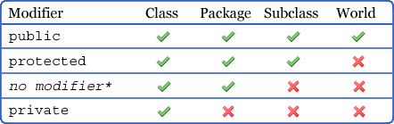
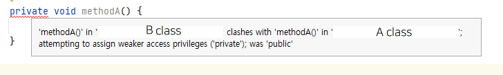
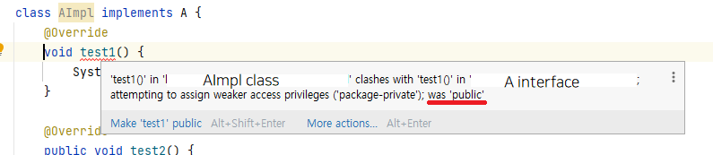

# Item15

# 정보 은닉과 캡슐화: 잘 설계된 컴포넌트의 핵심

## 잘 설계된 컴포넌트의 특징
1. 클래스 내부 데이터와 구현 정보를 외부로부터 잘 숨김.
2. 오직 API를 통해서만 다른 컴포넌트와 소통함.
3. 서로의 내부 동작 방식을 모름.

## 정보 은닉의 정의
- 다른 객체에게 자신의 정보를 숨기고 자신의 연산만을 통해 접근을 허용하는 것.

## 정보 은닉의 장점
1. 시스템 개발 속도 향상: 여러 컴포넌트를 병렬로 개발 가능.
2. 시스템 관리 비용 감소: 각 컴포넌트를 더 빨리 파악할 수 있고 교체 부담도 적음.
3. 성능 최적화에 도움.
4. 소프트웨어의 재사용성 증가.

## 자바의 접근 제어 메커니즘
- 클래스, 인터페이스, 멤버에 대한 접근 허용 범위를 명시.
- 기본 원칙: 모든 클래스와 멤버의 접근성은 가능한 한 좁혀야 함.

### 톱 레벨 클래스와 인터페이스의 접근 수준
1. `package-private` (default): 해당 패키지 안에서만 이용 가능 (내부 구현)
2. `public`: 공개 API (클라이언트에 영향)

### 멤버(필드, 메소드, 중첩 클래스, 중첩 인터페이스)의 접근 수준
1. `private`: 멤버를 선언한 톱레벨 클래스에서만 접근 가능
2. `package-private`: 멤버가 소속된 패키지 안의 모든 클래스에서 접근 가능
3. `protected`: package-private의 접근 범위를 포함하며, 이 멤버를 선언한 클래스의 하위 클래스에서도 접근 가능
4. `public`: 모든 곳에서 접근 가능



## 주의사항
1. `public`일 필요 없는 톱레벨은 반드시 `package-private`으로 범위를 좁힐 것.
2. 한 클래스에서만 사용하는 `package-private` 톱레벨 클래스나 인터페이스는 `private static` 중첩 클래스로 변경을 고려할 것.

## 코드 예시: package-private 클래스를 private static 중첩 클래스로 변경

```java
// 변경 전
public class A {
    private int a;
}
public class B { // B가 A에서만 쓰이는 클래스라면?
    private int b;
}

// 변경 후
public class A {
    private int a;
    
    private static class B {
        private int b;
    }
}
```

이렇게 변경하면 B 클래스는 A 클래스 내부에서만 접근 가능하게 되어, 불필요한 노출을 막을 수 있음.

## 권한 풀어주기
- 권한을 풀어주는 일이 지나치게 많아지면 컴포넌트를 더 분리해야 하는지 고민해야 함.

## 멤버와 공개 API
1. `protected`와 `public`
    - 해당 클래스의 구현을 벗어나 공개 API에 영향을 줄 수 있음.
    - 내부 동작 방식을 API 문서에 적어 사용자에게 공개하는 경우도 발생 (item 19).

2. `private`와 `package-private`
    - 일반적으로 내부 구현용.
    - 예외: Serializable을 직접 구현한 클래스에서는 공개 API가 될 수 있음 (item 86, 87).

> 참고: Serializable
> - Java 시스템 내부에서 사용되는 Object나 Data를 외부에서도 사용할 수 있도록 byte 형태로 변환하는 기술.
> - Serializable 인터페이스를 상속받음으로써 객체는 직렬화의 조건을 충족함.

## 멤버 접근성의 제약
- 리스코프 치환 원칙에 의해 상위 클래스의 메소드를 재정의하는 경우, 그 접근 수준을 상위 클래스보다 좁게 설정할 수 없음.
- 이 규칙을 어기면 컴파일 오류가 발생함.
- 예외: 클래스가 인터페이스를 구현하는 경우, 클래스의 메소드는 모두 `public`으로 선언해야 함.

### 예시 1: 클래스 상속에서의 접근 제어자 제약

```java
public class A {
    public void methodA() {
        System.out.println("A!!");
    }
}

public class B extends A {
    @Override
    private void methodA() { // 컴파일 오류 발생
        System.out.println("B!!");
    }
}
```




### 예시 2: 인터페이스 구현에서의 접근 제어자

```java
interface A {
    void test1();
    public void test2();
}

class AImpl implements A {
    @Override
    public void test1() { // public으로 선언해야 함
        System.out.println("test1");
    }

    @Override
    public void test2() {
        System.out.println("test2");
    }
}
```




## 리스코프 치환 원칙 (Liskov Substitution Principle)
- 정의: 상위 타입의 객체를 하위 타입의 객체로 치환해도 동작에 문제가 없어야 하는 규칙.
- 이 원칙은 객체지향 프로그래밍의 다형성을 지원하는 중요한 개념임.
- 접근 제어자와 관련하여, 하위 클래스에서 메소드를 재정의할 때 접근 수준을 더 좁게 설정할 수 없는 이유가 됨.

## public 클래스의 인스턴스 필드 

- `public final` 필드가 항상 불변성을 보장하지 않는다는 것!

### 문제점
- public 클래스의 인스턴스 필드가 `public`이면 필드가 언제든지 가변될 수 있음.
- `public final`로 선언해도 배열이나 List의 경우 값의 변경 여지가 있음.
- 캡슐화 원칙에 위배됨.

### 예시: public final 배열의 문제

```java
public class A {
  public final int[] arr = {1, 2, 3};
}

@Test
public void test() {
  A a = new A();
  a.arr[1] = 3;
  assertThat(a.arr[1]).isNotEqualTo(2);
}
```

- **final 변수의 의미**

final은 변수에 대한 **재할당을 금지**한다.
즉, 한 번 초기화되면 그 **참조를 변경할 수 없다.**


- **배열과 final**

배열 변수가 `final`이라는 것은 그 **변수가 항상 같은 배열 객체를 참조**한다는 의미다.
하지만 배열의 내용(요소)은 **final과 무관**하다.


- **참조 타입의 특성**

배열은 참조 타입이다.
final은 **참조 자체를 고정**하지만, 참조가 가리키는 **객체의 내용을 변경하는 것은 막지 않는다.**


### 예외: static final 상수
- 꼭 필요한 경우 `static final` 상수를 `public`으로 지정할 수 있음.
- 단, 배열이나 가변 List의 경우 주의 필요.

## 불변 객체로 반환하기

### 배열을 불변으로 반환
```java
Collections.unmodifiableList(Arrays.asList(배열));
배열.clone();
```

### 리스트를 불변으로 반환
```java
Collections.unmodifiableList(리스트);
```

## 테스트를 위한 접근성 확장

- `private` 멤버를 `package-private`(default)로 확장하는 것은 허용 가능.
- `protected`나 `public`으로 확장하는 것은 문제가 있음.
- 이런 경우, 테스트 목적이 무엇인지, 클래스 구조나 설계가 잘못되어 있는지 재검토 필요.

## Java 9와 모듈 시스템

### 모듈 시스템 개요
- 모듈: 패키지의 모음
- 모듈 정의 파일(`module-info.java`)에서 공개(export)할 패키지를 선언
- 선언되지 않은 패키지는 `public`, `protected` 멤버라도 모듈 외부에서 접근 불가

### 모듈 시스템의 영향
- JDK: 자바 라이브러리에서 공개하지 않은 패키지들은 해당 모듈 밖에서 접근 불가능

### 이전 버전과의 호환성
- 모듈 시스템 이전 코드: "이름 없는 모듈(Unnamed Module)"로 취급
- classpath에 로드된 JAR는 모듈 공개 여부와 상관없이 `public`, `protected` 멤버에 접근 가능
- 하위 호환성 유지를 위한 조치

## 결론
- 접근성은 가능한 한 최소화해야 함.
- 필요한 경우에만 제한적으로 접근성을 확장할 것.
- 모듈 시스템을 활용하여 더 세밀한 접근 제어 가능.

___

### 모듈시스템 보충정리

예를 들어, 다음과 같은 구조의 프로젝트가 있다고 가정해 보자

```
myapp
├── module-info.java
├── com
│   └── myapp
│       ├── api
│       │   └── UserService.java
│       └── internal
│           └── UserRepository.java
```

1. `module-info.java` (모듈 정의 파일):

```java
module myapp {
    exports com.myapp.api;
}
```

2. `UserService.java` (공개 API):

```java
package com.myapp.api;

public class UserService {
    public String getUsername() {
        return "John Doe";
    }
}
```

3. `UserRepository.java` (내부 구현):

```java
package com.myapp.internal;

public class UserRepository {
    public String fetchUsername() {
        return "John Doe from DB";
    }
}
```

이 구조에서:

1. `myapp` 모듈은 `com.myapp.api` 패키지만 외부에 공개(export)한다.
2. `com.myapp.internal` 패키지는 공개되지 않았으므로, 모듈 외부에서 접근할 수 없다.

이제 이 모듈을 사용하는 다른 프로젝트를 만들어 봅시다:

```
otherapp
├── module-info.java
└── com
    └── otherapp
        └── Main.java
```

1. `otherapp`의 `module-info.java`:

```java
module otherapp {
    requires myapp;
}
```

2. `Main.java`:

```java
package com.otherapp;

import com.myapp.api.UserService;
// import com.myapp.internal.UserRepository; // 이 import는 컴파일 에러를 발생시킵니다.

public class Main {
    public static void main(String[] args) {
        UserService userService = new UserService();
        System.out.println(userService.getUsername());

        // UserRepository userRepository = new UserRepository(); // 이 코드는 컴파일 에러를 발생시킵니다.
    }
}
```

이 예제에서:

1. `otherapp` 모듈은 `myapp` 모듈을 필요로 한다 (`requires myapp`).
2. `Main` 클래스는 `myapp` 모듈의 `com.myapp.api` 패키지에 있는 `UserService`를 사용할 수 있다.
3. 하지만 `com.myapp.internal` 패키지의 `UserRepository`는 사용할 수 없습다. 이 패키지는 `myapp` 모듈에서 공개하지 않았기 때문이다.

이렇게 모듈 시스템을 사용하면 모듈의 공개 API와 내부 구현을 명확히 구분할 수 있으며, 불필요한 의존성을 방지하고 캡슐화를 강화할 수 있다.